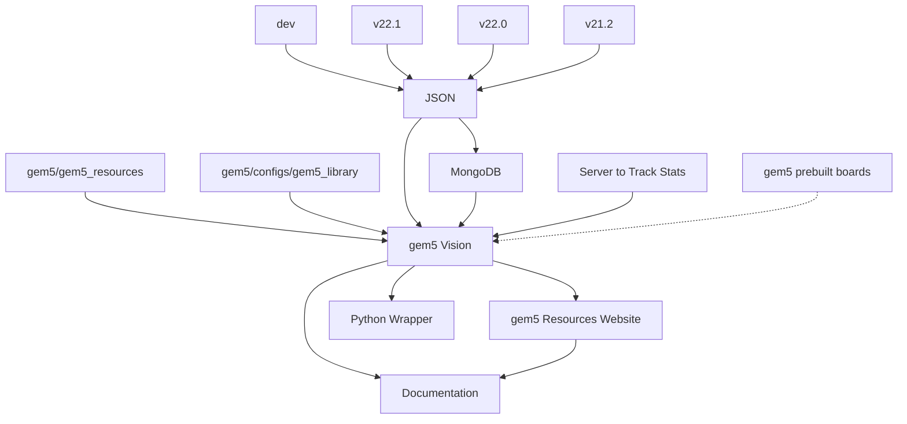

# gem5 Vision

## Team 11 (The Spidermen)

### Developers

- Kunal Pai
- Parth Shah
- Harshil Patel
- Arslan Ali

## What is gem5 Vision?

gem5 is a simulation software used by computer architects both in academia and the industry. Being a simulator, it also provides certain Resources relevant to computer architecture, like Kernels, Bootloaders, Benchmarks, and Disk Images to its users. Currently, the Resources are stored in a Google Cloud Bucket. The only way a user of gem5 can access information regarding which Resources exist is by going through the resources.json file available [here](https://gem5.googlesource.com/public/gem5-resources/+/refs/heads/stable/resources.json) manually, which can be cumbersome. Our main goal is to make *finding Resources easier for gem5 users and integrating it with other components of the gem5 ecosystem*. Part of this goal involves categorizing the available Resources and making these Categories and Groups filtrable, and creating compatibility links between existent Resources. It also involves linking a Resource with example code from the gem5 source code, and also linking it with README files present in the gem5_resources repository. Another aspect of this project is to use a server to track analytics of various Resources.

But, on top of that, to make the user experience better, additional goals include adding a beginners’ section for first-time users of gem5 and adding more information within the frontend rendering and the backend data of a particular Resource page. This information is meant to help users and includes input size, expected output, logging for particular benchmarks within the suite that do not work, dependencies, version compatibilities (with different versions of gem5), download sizes, direct download links for the Resource, and if the Resource is tested or not.

To make the administration of Resources better, additional goals involve integrating MongoDB into the current Python wrapper that downloads Resources.

## Tech Stack

- **Frontend**: React (w/ NextJS as the framework)
- **Database**: MongoDB + JSON
- **Backend**: Analytics Server
- **API Wrapper**: Python
- **Website Hosting**: GitHub Pages
- **Code**: GitHub Organization
- **Project Management**: Notion + Google Drive

## System Architecture Overview

## Documentation

This is still a work-in-progress, but you can find the following documentation:

1. [Complete Requirements document](https://github.com/Gem5Vision/gem5-resources-website/blob/static-website/REQUIREMENTS.md)
2. [JSON Schema](https://github.com/Gem5Vision/gem5-resources-website/blob/static-website/docs/JSONSchema.json)
3. [MongoDB Schema](https://github.com/Gem5Vision/gem5-resources-website/blob/static-website/docs/MongoDBSchema.json)
4. [API Documentation](https://github.com/Gem5Vision/gem5-resources-website/blob/static-website/pages/api/README.md)
5. [How Searching, Filtering and Sorting Works](https://github.com/Gem5Vision/gem5-resources-website/blob/static-website/pages/help.md)
